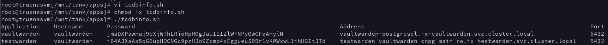
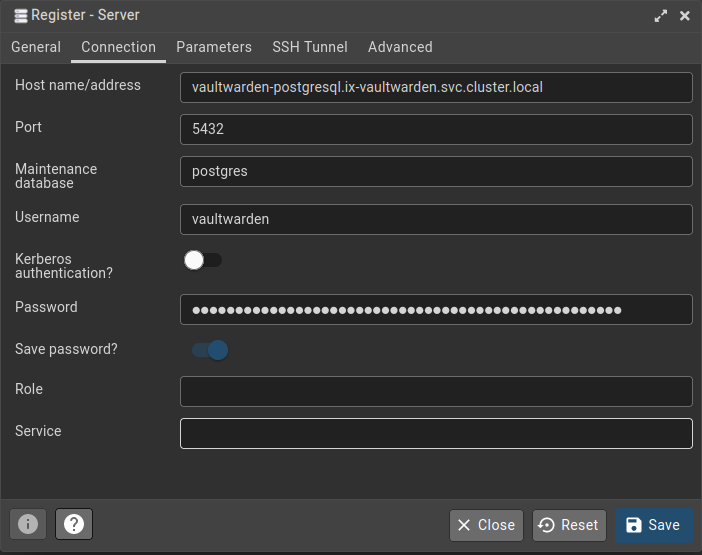
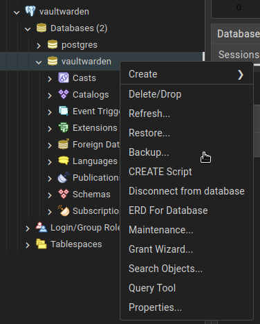
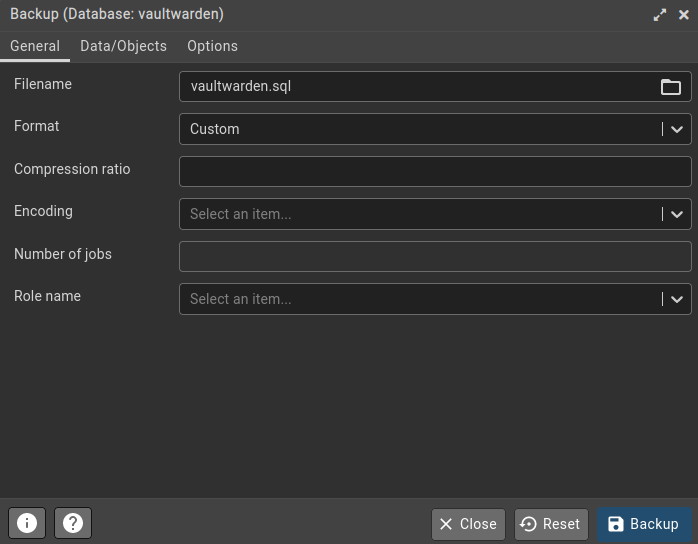
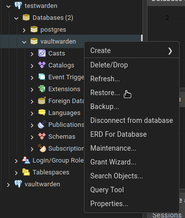
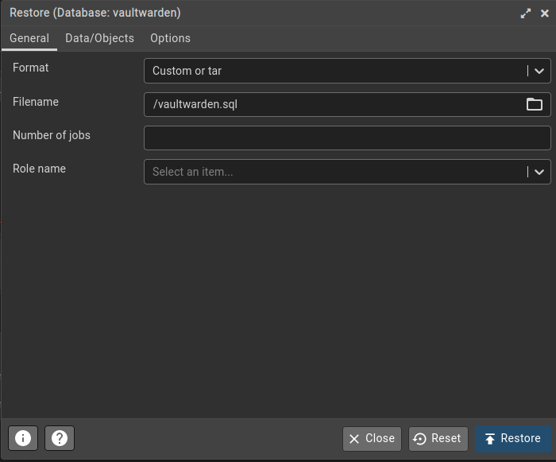
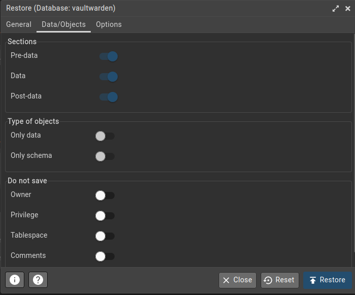
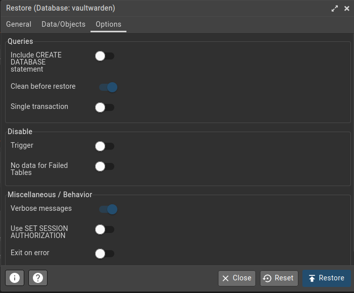

# Migrating

## Goal

A safe migration of an existing app to a new app, while still having the old app available. So if something goes wrong, you haven't lost the old app.

## Create new app with a different name

In this guide, I'll be using the app `vaultwarden` as an example. I chose the name `testwarden` for the new app install.

I installed the new app with mostly default settings, just changed service type to `ClusterIP` and setup a new, temporary, ingress.

## Scale down both apps

We need to run the following commands in the host shell. Everything between `<>` needs to be replaced with the actual value.

First, we need to get the names of the deploys.

```bash
k3s kubectl get deploy -n ix-<old-app>
k3s kubectl get deploy -n ix-<new-app>
```

Example:

```bash
root@truenasvm[/mnt/tank/apps]# k3s kubectl get deploy -n ix-vaultwarden
NAME          READY   UP-TO-DATE   AVAILABLE   AGE
vaultwarden   1/1     1            1           3h21m
root@truenasvm[/mnt/tank/apps]# k3s kubectl get deploy -n ix-testwarden
NAME                                  READY   UP-TO-DATE   AVAILABLE   AGE
testwarden-vaultwarden-cnpg-main-rw   2/2     2            2           3h12m
testwarden-vaultwarden                1/1     1            1           3h12m
```

Here we find the names of the deploys we want to scale down. For apps installed with the default name, it will just be that name.

For apps installed with a different name, it will be `<app-name>-<default-name>`.

So for `vaultwarden` (the default name), it will be `vaultwarden`. But for the vaultwarden app that was installed with the name `testwarden`, it will be `testwarden-vaultwarden`.

:::caution Replace the names in <> before executing commands

```bash
k3s kubectl scale deploy <app-name>-<default-name> -n ix-<app-name> --replicas=0
k3s kubectl scale deploy <app-name> -n ix-<app-name> --replicas=0
```

:::

:::caution Example commands for apps with name vaultwarden and testwarden

```bash
k3s kubectl scale deploy testwarden-vaultwarden -n ix-testwarden --replicas=0
k3s kubectl scale deploy vaultwarden -n ix-vaultwarden --replicas=0
```

:::

## Postgresql databases

:::info

You can skip this section if the app in question doesn't have a Postgresql database

:::

If the app uses a Postgresql database, we need to make a backup and restore that backup to the new app's database.

:::note Prerequisits

Make sure you have `pgadmin` installed, as we'll be using it to make a backup and to restore the database. It's a TrueCharts app from the stable train. You can install it with all default settings, and it will work.

Also make sure you have the database info script (`tcdbinfo.sh`) available on your server.

:::

<details>
  <summary>See example images for this section</summary>
  <div>
    <div>Some images in the right order, text details below.</div>
    <br/>
    
    
    
    
    
    
    
    
  </div>
</details>

### Configure database connections in pgadmin

run the tcdbinfo.sh script to see the connection details for both the old and the new database, and set them up in pgadmin.

### Create database backup

In `pgadmin`, right click `vaultwarden->Databases->vaultwarden` and click `Backup...`. Give the file a name (e.g. `vaultwarden.sql`) and click `Backup`.

### Restore database backup

In `pgadmin`, right click `testwarden->Databases->vaultwarden` and click `Restore...`. Select the sql file (`vaultwarden.sql`).

On the 2nd tab page, select the first 3 options (`Pre-data`, `Data` and `Post-data`). On the last tab, select `Clean before restore`. Now click `Restore`.

## Migrate the PVC's

The following command will return the data PVC's for the old and the new install

```bash
k3s kubectl get pvc -A | grep warden-data | sort -u | awk '{print $1, $2, $4}' | column -t
zfs list | grep warden | grep legacy
```

Destroy the PVC of the new app and replicate the PVC of the old app to the new location.

```bash
zfs destroy new-pvc
zfs snapshot old-pvc@migrate
zfs send old-pvc@migrate | zfs recv new-pvc@migrate
zfs set mountpoint=legacy new-pvc
```

The `new-pvc` will look something like `poolname/ix-applications/releases/testwarden/volumes/pvc-32341f93-0647-4bf9-aab1-e09b3ebbd2b3`.

The `old-pvc` will look something like `poolname/ix-applications/releases/vaultwarden/volumes/pvc-40275e0e-5f99-4052-96f1-63e26be01236`.

## Scale up both apps

```bash
k3s kubectl scale deploy testwarden-vaultwarden -n ix-testwarden --replicas=1
k3s kubectl scale deploy vaultwarden -n ix-vaultwarden --replicas=1
```

## Reflection

You should now be able to log in on the new install.